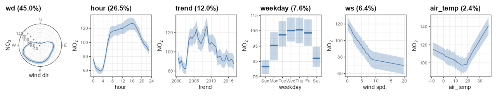

<div align="center">


## **deweather**
### open source tools to remove meteorological variation from air quality data

<!-- badges: start -->
[](https://github.com/openair-project/deweather/actions/workflows/R-CMD-check.yaml)
[](https://CRAN.R-project.org/package=deweather)
<br>
[](https://github.com/openair-project/deweather)
[](https://openair-project.github.io/deweather/)
[](https://openair-project.github.io/book/)
<!-- badges: end -->

</div>

**deweather** is an R package developed for the purpose of "removing" the influence of meteorology from air quality time series data. The package uses a *boosted regression tree* approach for modelling air quality data. These and similar techniques provide powerful tools for building statistical models of air quality data. They are able to take account of the many complex interactions between variables as well as non-linear relationships between the variables.

<div align="center">

*Part of the openair toolkit*

[](https://openair-project.github.io/openair/) | 
[](https://openair-project.github.io/worldmet/) | 
[](https://openair-project.github.io/openairmaps/) | 
[](https://openair-project.github.io/deweather/)

</div>

<hr>

## 💡 Core Features

**deweather** makes it straightforward to test, build, and evaluate models in R.

- **Test and build meteorological normalisation models** flexibly using `tune_dw_model()` and `build_dw_model()`.

- **Plot and examine models** in a myriad of ways, including visualising partial dependencies, using functions like `plot_dw_importance()`, `plot_dw_partial_1d()` and `plot_dw_partial_2d()`.

- **Apply meteorological averaging** using `simulate_dw_met()` to obtain a meteorologically normalised air quality timeseries.

Modelling can be computationally intensive and therefore **deweather** makes use of the parallel processing, which should work on Windows, Linux and Mac OSX.

<div align="center">

</div>

<hr>

## ⌛ Pre-1.0.0 deweather

**deweather** was overhauled in its 1.0.0 update. We believe this update makes `deweather` more modern and flexible, but we appreciate users may require access to or prefer the older version.

For this reason, the older, `gbm`-powered version of `deweather` can be accessed at <https://github.com/openair-project/deweather-archive>.

Note that the above repository is provided for archival purposes only, and is unlikely to recieve any future feature updates.

<hr>

## 📖 Documentation

All **deweather** functions are fully documented; access documentation using R in your IDE of choice.

```r
?deweather::build_dw_model
```

Documentation is also hosted online on the **package website**.

[](https://openair-project.github.io/deweather/)

A guide to the openair toolkit can be found in the **online book**, which contains lots of code snippets, demonstrations of functionality, and ideas for the application of **openair**'s various functions.

[](https://openair-project.github.io/book/)

<hr>

## 🗃️ Installation

**deweather** is not yet on **CRAN**.

The development version of **deweather** can be installed from GitHub using `{pak}`:

``` r
# install.packages("pak")
pak::pak("openair-project/deweather")
```

<hr>

🏛️ **deweather** is primarily maintained by [David Carslaw](https://github.com/davidcarslaw).

📃 **deweather** is licensed under the [MIT License](https://openair-project.github.io/deweather/LICENSE.html).

🧑‍💻 Contributions are welcome from the wider community. See the [contributing guide](https://openair-project.github.io/deweather/CONTRIBUTING.html) and [code of conduct](https://openair-project.github.io/deweather/CODE_OF_CONDUCT.html) for more information.
