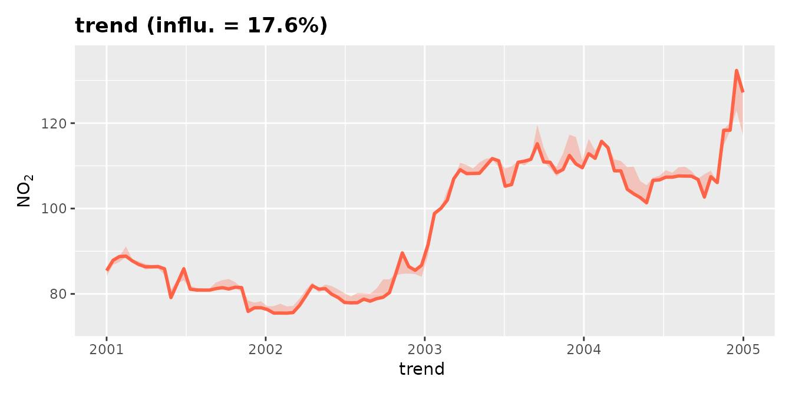

# Meteorological Normalisation with {deweather}

## Introduction

Meteorology plays a central role in affecting the concentrations of
pollutants in the atmosphere. When considering trends in air pollutants
it can be very difficult to know whether a change in concentration is
due to emissions or meteorology.

The **deweather** package uses a powerful statistical technique based on
*boosted regression trees* using a variety of packages using the
[tidymodels](https://tidymodels.tidymodels.org) framework. This allows
for a variety of engines to be employed, with the default being
[xgboost](https://github.com/dmlc/xgboost). Statistical models are
developed to explain concentrations using meteorological and other
variables. These models can be tested on randomly withheld data with the
aim of developing the most appropriate model.

Much of **deweather** supports parallel processing with the
[mirai](https://mirai.r-lib.org) package, so along with loading the
library we’ll set some daemons as well as a seed.

## Example data set

The **deweather** package comes with a comprehensive data set of air
quality and meteorological data. The air quality data is from Marylebone
Road in central London (obtained from the
[openair](https://openair-project.github.io/openair/) package) and the
meteorological data from Heathrow Airport (obtained from the
[worldmet](https://openair-project.github.io/worldmet/) package). The
`aqroadside` data frame contains various pollutants such a NO_(x), NO₂,
ethane and isoprene as well as meteorological data including wind speed,
wind direction, relative humidity, ambient temperature and cloud cover.

``` r
head(aqroadside)
#> # A tibble: 6 × 11
#>   date                  nox   no2 ethane isoprene benzene    ws    wd air_temp
#>   <dttm>              <dbl> <dbl>  <dbl>    <dbl>   <dbl> <dbl> <dbl>    <dbl>
#> 1 2000-01-01 00:00:00   388    78   13.5     1.22    7.74  2.1    200     7.4 
#> 2 2000-01-01 01:00:00   886    84   12.0     0.85    5.66  2.1    190     7.83
#> 3 2000-01-01 02:00:00   816   117   14.7     1.75   11.4   1.8    215     7.95
#> 4 2000-01-01 03:00:00   636    97   20.4     4.36   30.8   1.25   240     8.05
#> 5 2000-01-01 04:00:00   483    74   18.8     3.08   19.7   1.55   260     8.6 
#> 6 2000-01-01 05:00:00   231    65   16.4     2.12   13.1   2.35   270     8.35
#> # ℹ 2 more variables: rh <dbl>, cl <dbl>
```

## Prepare for Model Building

A straightforward way to get started is to use the
[`append_dw_vars()`](https://openair-project.github.io/deweather/reference/append_dw_vars.md)
function to attach a load of useful model features to your air quality
`data.frame`. Variables such as the hour of the day (`"hour"`) and day
of the week (`"weekday"`) are used as features to explain some of the
variation. `"hour"` for example very usefully acts as a proxy for the
diurnal variation in emissions. These temporal emission proxies are also
important to include to help the model differentiate between emission
versus weather-related changes. For example, emissions tend to change
throughout a day and so do variables such as wind speed and ambient
temperature (here already present in the data as `"ws"` and `"air_temp"`
respectively).

Note that, strictly,
[`append_dw_vars()`](https://openair-project.github.io/deweather/reference/append_dw_vars.md)
does not need to be run directly; if
[`build_dw_model()`](https://openair-project.github.io/deweather/reference/build_dw_model.md)
or
[`tune_dw_model()`](https://openair-project.github.io/deweather/reference/tune_dw_model.md)
are passed any of `"hour"`, `"weekday"`, `"trend"`, `"yday"`, `"week"`,
or `"month"` to `vars`, the parent function will use
[`append_dw_vars()`](https://openair-project.github.io/deweather/reference/append_dw_vars.md)
itself in the background if those columns do not exist in the input
dataframe.

``` r
append_dw_vars(aqroadside) |>
  dplyr::glimpse()
#> Rows: 149,040
#> Columns: 18
#> $ date     <dttm> 2000-01-01 00:00:00, 2000-01-01 01:00:00, 2000-01-01 02:00:0…
#> $ nox      <dbl> 388, 886, 816, 636, 483, 231, 380, 287, 187, 111, 149, 132, 3…
#> $ no2      <dbl> 78, 84, 117, 97, 74, 65, 67, 69, 67, 57, 57, 57, 82, 84, 76, …
#> $ ethane   <dbl> 13.54, 11.99, 14.69, 20.38, 18.75, 16.38, 16.16, NA, NA, NA, …
#> $ isoprene <dbl> 1.22, 0.85, 1.75, 4.36, 3.08, 2.12, 1.25, NA, NA, NA, NA, 0.4…
#> $ benzene  <dbl> 7.74, 5.66, 11.38, 30.75, 19.66, 13.13, 7.64, NA, NA, NA, NA,…
#> $ ws       <dbl> 2.10, 2.10, 1.80, 1.25, 1.55, 2.35, 1.80, 1.00, 0.50, 0.00, 0…
#> $ wd       <dbl> 200, 190, 215, 240, 260, 270, 260, 250, 240, NA, 210, 275, 26…
#> $ air_temp <dbl> 7.400000, 7.833333, 7.950000, 8.050000, 8.600000, 8.350000, 8…
#> $ rh       <dbl> 97.33482, 97.15970, 99.00136, 98.67437, 95.11393, 97.71058, 9…
#> $ cl       <dbl> 5.0, 6.0, 4.5, 4.5, 7.5, 5.5, 8.0, 4.0, 1.5, 2.5, 4.0, 7.0, 4…
#> $ trend    <dbl> 946684800, 946688400, 946692000, 946695600, 946699200, 946702…
#> $ hour     <int> 0, 1, 2, 3, 4, 5, 6, 7, 8, 9, 10, 11, 12, 13, 14, 15, 16, 17,…
#> $ weekday  <fct> Sat, Sat, Sat, Sat, Sat, Sat, Sat, Sat, Sat, Sat, Sat, Sat, S…
#> $ weekend  <fct> weekend, weekend, weekend, weekend, weekend, weekend, weekend…
#> $ yday     <int> 1, 1, 1, 1, 1, 1, 1, 1, 1, 1, 1, 1, 1, 1, 1, 1, 1, 1, 1, 1, 1…
#> $ week     <int> 1, 1, 1, 1, 1, 1, 1, 1, 1, 1, 1, 1, 1, 1, 1, 1, 1, 1, 1, 1, 1…
#> $ month    <fct> Jan, Jan, Jan, Jan, Jan, Jan, Jan, Jan, Jan, Jan, Jan, Jan, J…
```

## Build a Model

### Tuning a Model

There are many input parameters to
[`build_dw_model()`](https://openair-project.github.io/deweather/reference/build_dw_model.md)
and, while sensible defaults have been set, you may be interested in
seeing how tweaking them can influence how well the model behaves. This
is called “tuning”, and the
[`tune_dw_model()`](https://openair-project.github.io/deweather/reference/tune_dw_model.md)
function provides an interface for this. Any of the boosted decision
tree parameters (e.g., `tree_depth` and `trees`) can be set as a range
which is then combined with `grid_levels` to create a regular grid of
all parameter combinations.

Note that this process can take a while, especially if many parameters
are being tuned. One way to speed this up is to invoke parallel
processing through the `mirai` package - see
<https://tune.tidymodels.org/articles/extras/optimizations.html#parallel-processing>
for more information. In this example, we’ll also significantly trim
down the data to speed things up.

``` r
tuned_results <-
  aqroadside |>
  # want to sample by weekday to get good spread of categorical data
  append_dw_vars("weekday") |>
  dplyr::slice_sample(n = 250, by = weekday) |>
  # tune model
  tune_dw_model(
    pollutant = "no2",
    tree_depth = c(1, 5),
    trees = c(150, 250),
    grid_levels = 3L
  )
#> → A | warning: `early_stop` was reduced to 149.
#> There were issues with some computations   A: x1
#> There were issues with some computations   A: x1
#> 
```

This output has a few useful features. First, we’re informed that the
best value for `trees` is 150 and for `tree_depth` is 5.

``` r
tuned_results$best_params
#> $trees
#> [1] 150
#> 
#> $tree_depth
#> [1] 5
```

We can also see how the tuned model behaved on some reserved testing
data. A table of predictions is returned, as well as a table of
statistics and a scatter plot of modelled vs measured values.

``` r
dplyr::glimpse(tuned_results$final_fit$metrics)
#> Rows: 1
#> Columns: 12
#> $ pollutant <fct> no2
#> $ n         <int> 424
#> $ fac2      <dbl> 0.9716981
#> $ mb        <dbl> -1.593782
#> $ mge       <dbl> 19.85444
#> $ nmb       <dbl> -0.01676148
#> $ nmge      <dbl> 0.208805
#> $ rmse      <dbl> 27.60343
#> $ r         <dbl> 0.8157166
#> $ p         <dbl> 2.258024e-102
#> $ coe       <dbl> 0.4743745
#> $ ioa       <dbl> 0.7371873
```

``` r
tuned_results$final_fit$plot
```


### Finalising a Model

Assuming that a good model can be developed, it can now be explored in
more detail. `deweather` has useful defaults for many of the model
parameters, but these can be adjusted by the user if required.

``` r
no2_model <-
  build_dw_model(
    data = aqroadside,
    pollutant = "no2",
    vars = c("trend", "ws", "wd", "hour", "weekday", "air_temp"),
    engine = "xgboost"
  )
```

This function returns a “deweathering model” object. We can see a quick
summary of it by simply printing it.

``` r
no2_model
#> 
#> ── Deweather Model ─────────────────────────────────────────────────────────────
#> • A model for predicting no2 using wd (42.1%), hour (27.9%), trend (12.8%),
#>   weekday (8.2%), ws (6.5%), and air_temp (2.6%).
#> 
#> 
#> ── Model Parameters ──
#> 
#> 
#> 
#> • tree_depth: 5
#> 
#> • trees: 200
#> 
#> • learn_rate: 0.1
#> 
#> • mtry: NULL
#> 
#> • min_n: 10
#> 
#> • loss_reduction: 0
#> 
#> • sample_size: 1
#> 
#> • stop_iter: 190
```

We can also pull out specific features of the model using `get_dw_*()`
functions. [deweather](https://openair-project.github.io/deweather/) has
many of such ‘getter’ functions, and they form a consistent, useful API
for accessing relevant features of different objects created in the
package.

``` r
get_dw_pollutant(no2_model)
#> [1] "no2"
get_dw_vars(no2_model)
#> [1] "trend"    "ws"       "wd"       "hour"     "weekday"  "air_temp"
get_dw_input_data(no2_model)
#> # A tibble: 144,535 × 7
#>      no2     trend    ws    wd  hour weekday air_temp
#>    <dbl>     <dbl> <dbl> <dbl> <int> <fct>      <dbl>
#>  1    78 946684800  2.1    200     0 Sat         7.4 
#>  2    84 946688400  2.1    190     1 Sat         7.83
#>  3   117 946692000  1.8    215     2 Sat         7.95
#>  4    97 946695600  1.25   240     3 Sat         8.05
#>  5    74 946699200  1.55   260     4 Sat         8.6 
#>  6    65 946702800  2.35   270     5 Sat         8.35
#>  7    67 946706400  1.8    260     6 Sat         8.2 
#>  8    69 946710000  1      250     7 Sat         7.1 
#>  9    67 946713600  0.5    240     8 Sat         6.2 
#> 10    57 946720800  0.5    210    10 Sat         6.9 
#> # ℹ 144,525 more rows
```

One feature we immediately have access to is the “feature importance”
score. This can be obtained as a `data.frame` using a similar approach
to the above. This varies depending on the chosen `engine`, but for
boosted trees this represents ‘Gain’ - the fractional contribution of
each feature to the model based on the total gain of this feature’s
splits. A higher percentage means a more important predictive feature.

``` r
get_dw_importance(no2_model)
#> # A tibble: 12 × 2
#>    var        importance
#>    <fct>           <dbl>
#>  1 wd           0.421   
#>  2 hour         0.279   
#>  3 trend        0.128   
#>  4 ws           0.0646  
#>  5 weekdaySun   0.0450  
#>  6 weekdaySat   0.0282  
#>  7 air_temp     0.0262  
#>  8 weekdayMon   0.00257 
#>  9 weekdayThu   0.00230 
#> 10 weekdayWed   0.00163 
#> 11 weekdayTue   0.001000
#> 12 weekdayFri   0.000862
```

The Gain can be automatically plotted as a bar chart using the
[`plot_dw_importance()`](https://openair-project.github.io/deweather/reference/plot_dw_importance.md)
function. The wind direction is the most predictive feature, and the day
of the week being any week day is the least predictive feature.

``` r
plot_dw_importance(no2_model)
```


The feature importance of our model.

You’ll notice that our ‘character’ variable, the day of the week, has
been split out into multiple levels. This is because
[xgboost](https://github.com/dmlc/xgboost) requires numeric variables,
so behind the scenes our ‘day of the week’ variable is split out into a
matrix of seven variables. This is informative - for example, we can see
here that the day of the week being a weekend is a useful feature.
Regardless, if you would like to see factor features as single features,
the `aggregate_factors` argument may be of use.

``` r
plot_dw_importance(no2_model, aggregate_factors = TRUE)
```


The feature importance of our model, with factors aggregated.

## Examine the partial dependencies

### Basic PD Plots

One of the benefits of the boosted regression tree approach is that the
*partial dependencies* can be explored. In simple terms, the partial
dependencies show the relationship between the pollutant of interest and
the covariates used in the model while holding the value of other
covariates at their mean level.

Lets plot a partial dependency for the `hour` variable. We’ll set `n` to
`100` for speed; this will sample 100 random samples of our original
data to construct the plot. We can see that `no2` is highest during the
day and lowest overnight, everything else kept equal.

``` r
plot_dw_partial_1d(no2_model, "hour", n = 100)
```


A categorical variable like `weekday` looks slightly different, but
achieves a similar result. `no2` is lowest on weekends, all else being
equal.

``` r
plot_dw_partial_1d(no2_model, "weekday", n = 100)
```


If a variable isn’t given, all variables will be plotted in a
`patchwork` assembly in order of importance.

``` r
plot_dw_partial_1d(no2_model, n = 100)
```


### Grouped PD

Sometimes, when examining partial dependences, it is useful to consider
*grouped* partial dependences. This means, before PDs are calculated, we
split the data into groups and calculate PDs for each subset of the
data. Let’s give this a go now.

``` r
plot_dw_partial_1d(no2_model, "hour", group = "weekday", n = 1000)
```


Note that `group` need not be categorical; you may provide a continuous
variable which will be binned into `group_intervals`. Here we group by
`"air_temp"` and split it into 3 equally sized bins.

``` r
plot_dw_partial_1d(
  no2_model,
  "hour",
  group = "air_temp",
  group_intervals = 3L,
  n = 1000
)
```


### Two-Way Interactions

Above we needed to treat one of our continuous features as a factor
feature.

It can be very useful to plot important two-way interactions. In this
example the interaction between `"ws"` and `"air_temp"` is considered.
The plot shows that `no2` tends to be high when the wind speed is low
and the temperature is low, i.e., stable atmospheric conditions. Also
`no2` tends to be high when the temperature is high, which is most
likely due to more O₃ available to convert NO to NO₂. In fact,
background O₃ would probably be a useful covariate to add to the model.

``` r
plot_dw_partial_2d(no2_model, "ws", "air_temp", n = 200)
```


It can be easier to see some of these relationships using a binned
scale. `contour = "lines"` will overlay the continuous colour surface
with contour lines. `contour = "fill"` will bin the entire colour scale.
The number of bins is controlled using the `contour_bins` argument.

``` r
plot_dw_partial_2d(
  no2_model,
  "ws",
  "air_temp",
  n = 200,
  contour = "fill",
  contour_bins = 10,
  cols = "turbo"
)
```


## Customisation

These plots can be customised like any other
[ggplot2](https://ggplot2.tidyverse.org) object.

``` r
library(ggplot2)

plot_dw_partial_1d(no2_model, "hour",group = "weekday") +
  theme_light(14) +
  theme(
    title = element_text(face = "bold"),
    plot.subtitle = element_text(face = "plain", size = 11),
    legend.position = "none"
  ) +
  scale_fill_manual(
    values = c(
      "orange",
      "cadetblue",
      "lightblue4",
      "lightblue3",
      "lightblue2",
      "lightblue1",
      "orange3"
    ),
    aesthetics = c("fill", "color")
  ) +
  labs(
    x = "Hour of the Day",
    y = "NOx (ug/m3)",
    fill = "Weekday",
    color = "Weekday",
    subtitle = "Weekends (orange) have lower NOx emissions than weekdays (blue)."
  ) +
  scale_y_continuous(limits = c(0, NA)) +
  scale_x_continuous(breaks = seq(0, 24, 4), expand = expansion())
#> Scale for fill is already present.
#> Adding another scale for fill, which will replace the existing scale.
#> Scale for x is already present.
#> Adding another scale for x, which will replace the existing scale.
```


A thoroughly customised partial dependence plot.

## Apply meteorological averaging

An *indication* of the meteorologically-averaged trend is given by the
[`plot_dw_partial_1d()`](https://openair-project.github.io/deweather/reference/plot_dw_partial_1d.md)
function above.

``` r
plot_dw_partial_1d(no2_model, "trend", n = 100, intervals = 100)
```



A much better indication is given by using the model to predict many
times with random sampling of **meteorological** conditions. This
sampling is carried out by the `simulate_met()` function.

Note that you’d typically want `n` to be a higher value than what’s used
in this example; it has been set to `50` for speed. Recall also that
some
[`mirai::daemons()`](https://mirai.r-lib.org/reference/daemons.html) are
set to allow for parallelism.

``` r
demet <- simulate_dw_met(
  no2_model,
  vars = c("ws", "wd", "air_temp"),
  n = 50
)
```

Now it is possible to plot the resulting trend.

``` r
library(ggplot2)

ggplot(demet, aes(x = date, y = no2)) +
  geom_line(linewidth = 0.01) +
  theme_bw() +
  labs(
    y = openair::quickText("NO2"),
    x = NULL
  )
```


A deweathered nitrogen dioxide trend.

The plot shows the trend in NO₂ controlling for the main weather
variables. The plot now reveals the strong diurnal and weekly cycle in
NO₂ that is driven by variations in the sources of NO₂ (NO_(x)) rather
than meteorology, i.e., road traffic which has strong hourly and daily
variations throughout the year. It can be useful to simply average the
results to provide a better indication of the overall trend. For
example:

``` r
demet |>
  openair::timeAverage("month") |>
  ggplot(aes(x = date, y = no2)) +
  geom_line() +
  theme_bw() +
  labs(
    y = openair::quickText("NO2"),
    x = NULL
  )
```


A time-averaged deweathered nitrogen dioxide trend.

With some simple data manipulation, we can compare the meteorological
simulation, the partial dependence profile, and the input data. It is
clear that the input data has much more noise. The PD profile are
simulated data are similar, but the simulated data are higher overall.
This highlights that purely relying on the PD profiles (which isolates
the trend from even temporal variables like day of the week) may
underestimate pollutant concentrations.

``` r
# PD - set intervals to something high for a good profile
pd_trend <- plot_dw_partial_1d(
  no2_model,
  "trend",
  plot = FALSE,
  n = 50,
  intervals = 200
) |>
  purrr::pluck("trend") |>
  dplyr::transmute(
    date = as.POSIXct(trend),
    no2 = mean
  )

# input data
input_data <- get_dw_input_data(no2_model) |>
  dplyr::transmute(
    date = as.POSIXct(trend),
    no2 = no2
  )

# combine with demet and plot
dplyr::bind_rows(
  "Simulated" = demet,
  "Input" = input_data,
  "Partial Dep" = pd_trend,
  .id = "source"
) |>
  openair::timeAverage("month", type = "source") |>
  ggplot(aes(x = date, y = no2, color = source)) +
  geom_line() +
  theme_bw() +
  labs(
    y = openair::quickText("NO2"),
    x = NULL
  ) +
  scale_color_manual(
    values = c(
      "Input" = "grey70",
      "Partial Dep" = "orange",
      "Simulated" = "royalblue"
    )
  )
```


Note that the function
[`predict_dw()`](https://openair-project.github.io/deweather/reference/predict_dw.md)
is also provided for generalised use of a deweather model for
prediction.
